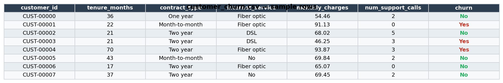
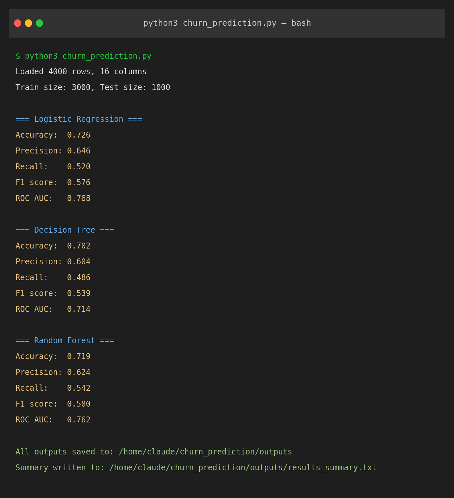
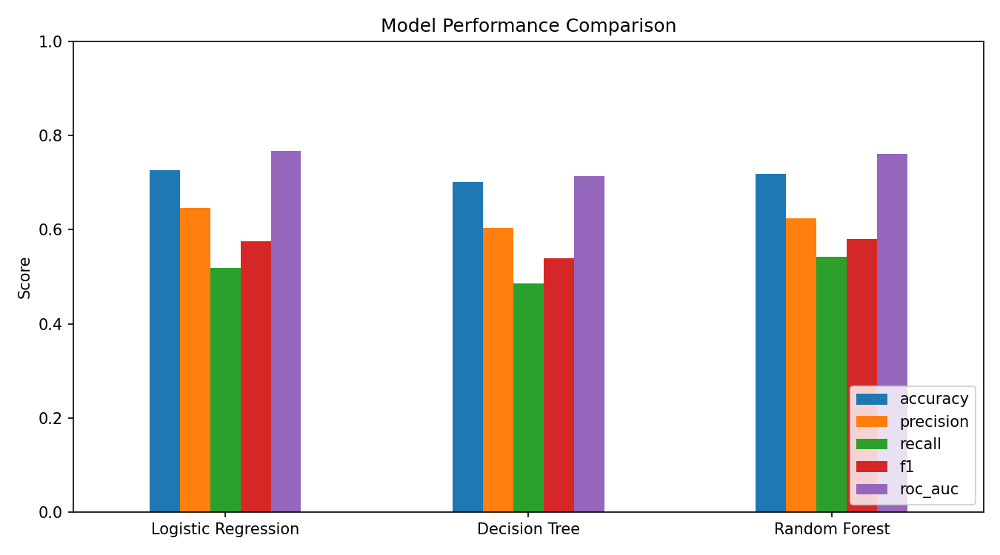
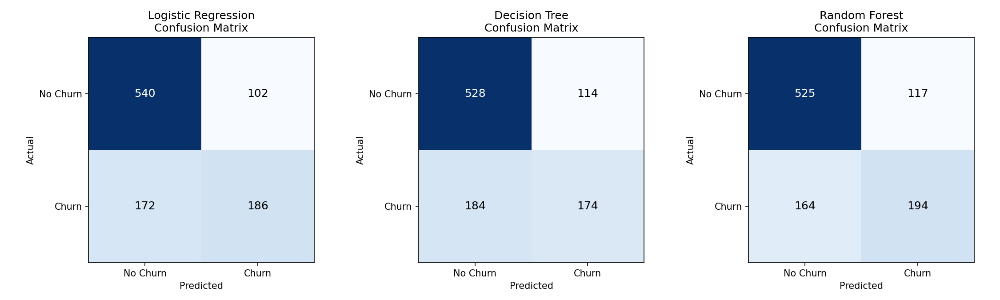
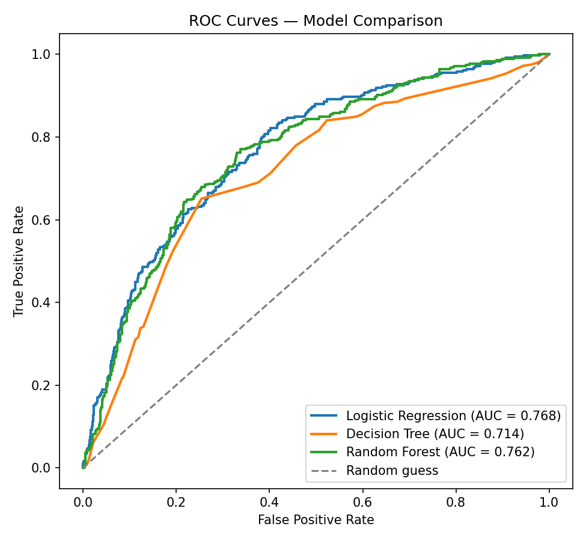
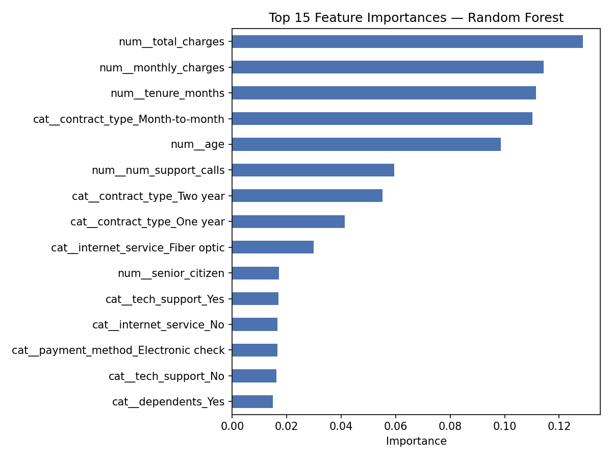

# 📊 Customer Churn Prediction — Supervised Learning with Scikit-learn


A complete, from-scratch supervised learning project: predict whether a
customer will **churn** (leave the business) using **Logistic Regression**,
a **Decision Tree**, and a **Random Forest** — then compare them with
confusion matrices, ROC curves, and standard classification metrics.

---

## 🚀 Quick start

```bash
git clone https://github.com/<your-username>/customer-churn-prediction.git
cd customer-churn-prediction
pip install -r requirements.txt
python3 churn_prediction.py
```

All charts and a results summary are written to `outputs/`.

---

## 📁 Project structure

```
customer-churn-prediction/
├── README.md
├── LICENSE
├── .gitignore
├── requirements.txt
├── churn_prediction.py          # Main pipeline: preprocess → train → evaluate → visualize
├── data/
│   ├── generate_data.py         # Generates the synthetic dataset
│   └── customer_churn.csv       # 4,000-row churn dataset
├── notebooks/
│   └── churn_prediction.ipynb   # Same pipeline, notebook form
├── outputs/                     # Generated on each run
│   ├── results_summary.txt
│   ├── confusion_matrices.png
│   ├── roc_curves.png
│   ├── model_comparison.png
│   └── feature_importance.png
└── screenshots/                 # For this README
```

---

## 🗂️ Dataset

`data/customer_churn.csv` is a synthetic but realistic telecom-style churn
dataset (4,000 customers, ~36% churn rate) with features like tenure,
contract type, internet service, monthly/total charges, support calls, and
demographics. Churn labels are generated from real underlying relationships
(month-to-month contracts, fiber internet, and frequent support calls all
raise churn risk), so the models have genuine signal to learn — similar in
spirit to the public "Telco Customer Churn" dataset.

<p align="center">
  
</p>

Regenerate it any time (or tweak `data/generate_data.py` to change size/noise):

```bash
python3 data/generate_data.py
```

---

## ⚙️ Pipeline

1. **Load** the CSV into a pandas DataFrame.
2. **Preprocess** — numeric features are standardized (`StandardScaler`),
   categorical features are one-hot encoded, all inside a single
   scikit-learn `ColumnTransformer` + `Pipeline` (no data leakage).
3. **Split** — 75% train / 25% test, stratified on the target.
4. **Train three models**:
   - Logistic Regression (linear baseline)
   - Decision Tree (max depth 6)
   - Random Forest (300 trees, max depth 10)
5. **Evaluate** with accuracy, precision, recall, F1, and ROC-AUC.
6. **Visualize** confusion matrices, ROC curves, a metric comparison chart,
   and Random Forest feature importances.

---

## 🖥️ Example run

<p align="center">
  
</p>

---

## 📈 Results

| Model               | Accuracy | Precision | Recall | F1    | ROC-AUC |
|---------------------|----------|-----------|--------|-------|---------|
| Logistic Regression | 0.726    | 0.646     | 0.520  | 0.576 | 0.768   |
| Decision Tree       | 0.702    | 0.604     | 0.486  | 0.539 | 0.714   |
| Random Forest       | 0.719    | 0.624     | 0.542  | 0.580 | 0.762   |

<p align="center">
  
</p>

Logistic Regression edges out the others on ROC-AUC, with Random Forest
close behind and slightly better recall — a good reminder that more
complex models don't automatically win, especially on moderately-sized,
mostly-linear-signal data like this.

### Confusion matrices

<p align="center">
  
</p>

### ROC curves

<p align="center">
  
</p>

### What drives churn? (Random Forest feature importance)

<p align="center">
  
</p>

Contract type, tenure, and internet service type turn out to be the
strongest predictors — consistent with real-world churn analyses.

Full per-class precision/recall for every model is in
`outputs/results_summary.txt` after each run.

---

## 🛠️ Built with

- [pandas](https://pandas.pydata.org/) / [NumPy](https://numpy.org/) — data handling
- [scikit-learn](https://scikit-learn.org/) — modeling & evaluation
- [Matplotlib](https://matplotlib.org/) — visualization

---

## 🔭 Ideas to extend this

- Swap in your own dataset (point `DATA_PATH` in `churn_prediction.py` at
  your CSV and update the feature lists).
- Add hyperparameter tuning (`GridSearchCV` / `RandomizedSearchCV`).
- Add gradient boosting (`XGBoost`, `LightGBM`, or
  `GradientBoostingClassifier`) for comparison.
- Handle class imbalance explicitly (`class_weight="balanced"`, SMOTE).
- Add SHAP values for per-prediction explainability.

---

## 📄 License

This project is licensed under the [MIT License](LICENSE).
